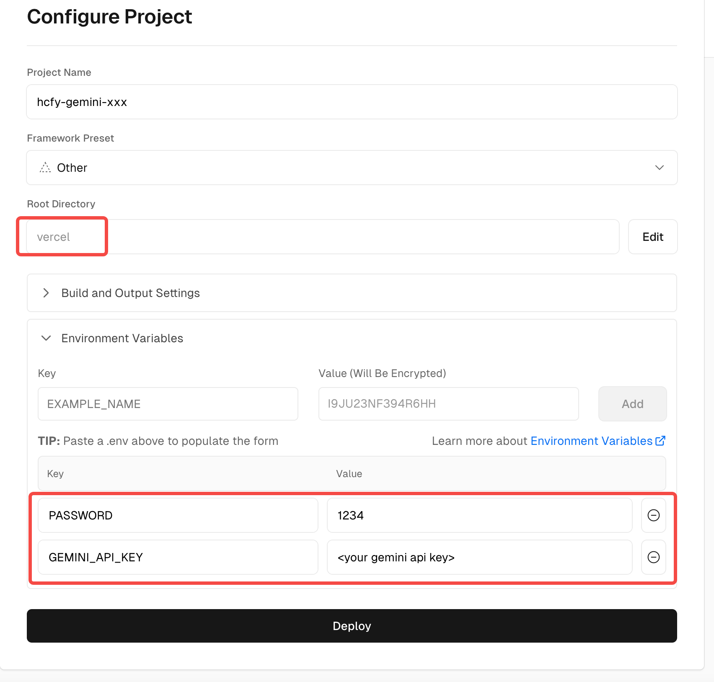
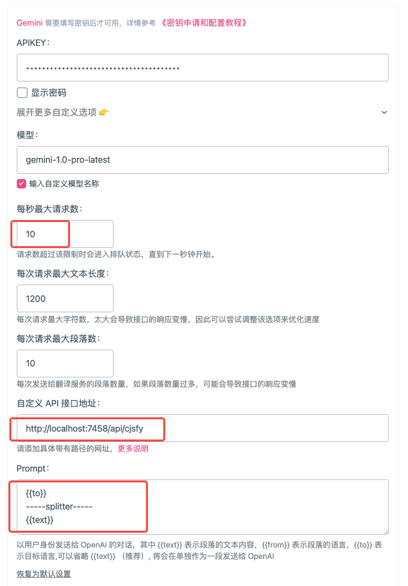

## hfcy-gemini

### Usage

1. Compile `go build .`
2. Edit `config.json` to fill the gemini APIKey from https://makersuite.google.com/app/apikey.
3. Start the server `./hcfy-gemini`
4. Fill `http://localhost:7458/api/hcfy` to the hcfy setting.

    

### Deploy to Vercel

1. Create a new [Vercel](https://vercel.com) project by importing this repo.

    1. Set "Framework Preset" to `Other`.
    2. Set "Root Directory" to `vercel`.
    3. Add environment variables:
        * `GEMINI_API_KEY`: your gemini APIKey.
        * `PASSWORD`: an arbitrary string that used to protect your Vercel API endpoint.

    

4. Fill `https://<your project name>.vercel.app/api/hcfy?pass=<your password>` to the hcfy setting.

    

### Deploy with Docker

1. Build image.

    ```bash
    docker build -t hcfy-gemini:latest .
    ```

2. Run.

    ```bash
    docker run -d \
      --name hcfy-gemini \
      -e GEMINI_API_KEY="<your gemini APIKey>" \
      -e MODEL_NAME="gemini-1.5-flash-latest" \
      -e PASSWORD="<arbitrary string>" \
      -p 7458:7458 \
      --restart unless-stopped \
      hcfy-gemini:latest
    ```

3. Fill `http://<server hostname>:7458/api/hcfy?pass=<PASSWORD>` to the hcfy setting.

### For Immersive Translate

1. The `APIKEY` and `model` fields will not be used by `hcfy-gemini`, so you can fill in any values for them.
2. You can increase the value of `Maximum Requests Per Second` appropriately.
3. Fill `http://<server host>:<port>/api/cjsfy` to the `Custom API Endpoint` field.
4. For the `Prompt`, fill in the following:

    ```plaintext
    {{to}}
    -----splitter-----
    {{text}}
    ```


