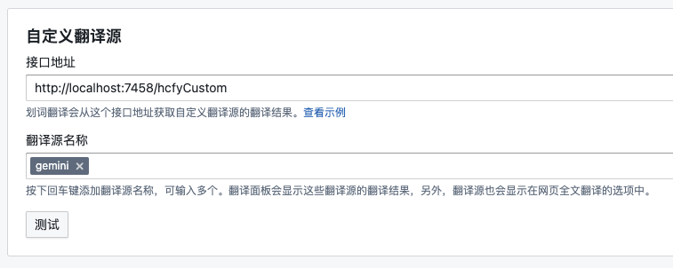
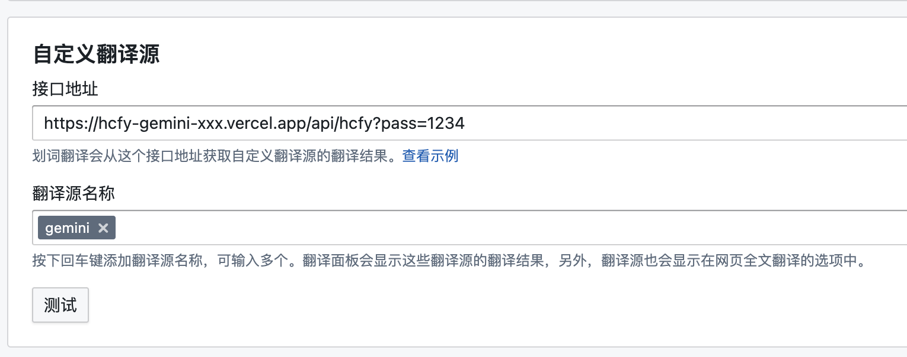

## hfcy-gemini

### Usage

1. Compile `go build .`
2. Edit `config.json` to fill the gemini APIKey from https://makersuite.google.com/app/apikey.
3. Start the server `./hcfy-gemini`
4. Fill `http://localhost:7458/api/hcfy` to the hcfy setting.

    

### Deploy to Vercel

1. Create a new [Vercel](https://vercel.com) project by importing this repo.
2. Set "Root Directory" to `vercel`.
3. Add environment variables:
    * `GEMINI_API_KEY`: the value is your gemini APIKey
    * `PASSWORD`: the value is an arbitrary string that used to protect your Vercel API endpoint
4. Fill `https://<your project domain>.vercel.app/api/hcfy?pass=<your password>` to the hcfy setting.

    